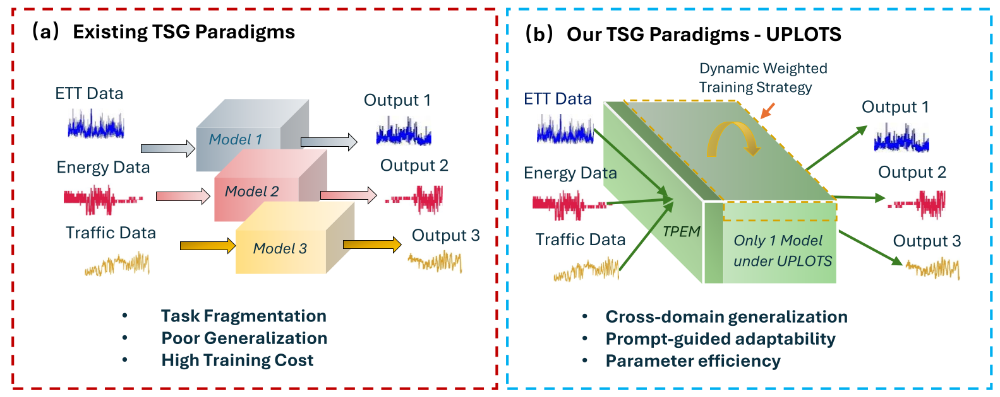
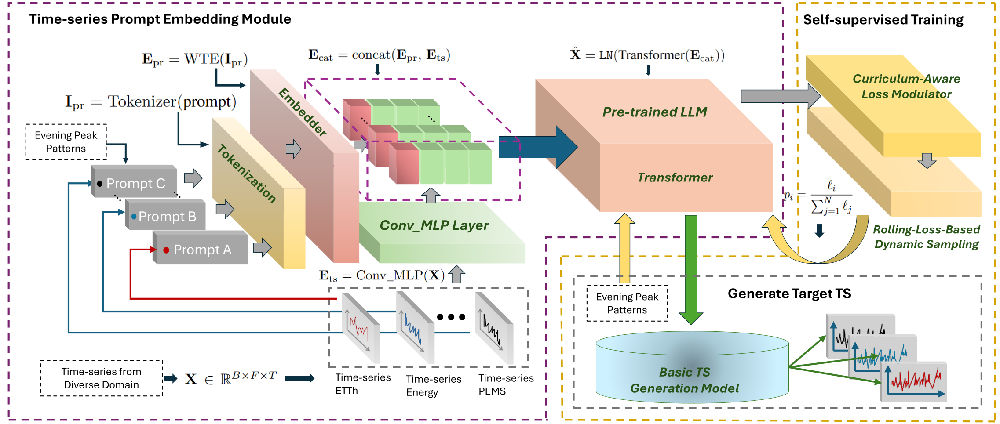

# UPLOTS: A Unified, Prompt-guided Language Model for Constrained Time-Series Generation

Official implementation of **UPLOTS**.

> Existing time-series generation (TSG) methods handcraft or train a separate model per
> dataset, which does not scale and ignores temporal structure shared across domains.
> **UPLOTS** replaces this "one model per dataset" paradigm with a **single pre-trained
> language-model backbone** guided by **learned constraint prompts**: one model is trained
> on a mixture of all temporal patterns and, at inference, generates a customized target
> sequence on demand. Key ingredients are a **Time-series Prompt Embedding Module (TPEM)**
> and a **Dynamic Weighted Training Strategy** (Curriculum-Aware Loss Modulator +
> Rolling-Loss-Based Dynamic Sampling) for stable multi-dataset learning.

We evaluate on four real-world benchmarks (ETTh, Energy, PEMS04, PEMS08) under multiple
constraint families — **peak-period, calendar, load-level, and volatility** — plus
held-out constraint-combination generalization and downstream forecasting.

---

## Method

**Motivation.** Conventional TSG trains a *separate* model per dataset (Fig. 1a), causing
task fragmentation, poor cross-domain generalization, and high training cost. UPLOTS uses
**one** model for all datasets (Fig. 1b), conditioning generation on natural-language
constraint prompts for cross-domain generalization, prompt-guided adaptability, and
parameter efficiency.

<p align="center">
  <br>
  <b>Figure 1.</b> Existing one-model-per-dataset TSG (left) vs. the unified, prompt-guided UPLOTS (right).
</p>

**Architecture.** A constraint prompt (e.g. *"Evening Peak Patterns"*) is tokenized and
embedded by the **Time-series Prompt Embedding Module (TPEM)**
(`E_pre = WTE(Tokenizer(prompt))`), while the input series `X ∈ ℝ^{B×F×T}` is encoded by a
`Conv_MLP` layer into `E_ts`. The two are concatenated (`E_cat = concat(E_pre, E_ts)`) and
fed to a **frozen pre-trained LLM/Transformer backbone** with only lightweight parameters
adapted (LayerNorm + positional embeddings): `X̂ = LN(Transformer(E_cat))`. Training is
self-supervised and stabilized across heterogeneous datasets by the **Dynamic Weighted
Training Strategy** — a *Curriculum-Aware Loss Modulator* that down-weights noisy/trivial
tasks early, plus *Rolling-Loss-Based Dynamic Sampling* that allocates more updates to
underperforming datasets. At inference, swapping the prompt generates the target pattern
on demand.

<p align="center">
  <br>
  <b>Figure 2.</b> UPLOTS overview: TPEM fuses prompt + series embeddings into a pre-trained
  LLM backbone, trained self-supervised with the Dynamic Weighted Training Strategy.
</p>

---

## Repository layout

```
UPLOTS/
├── uplots/                  # The unified prompt-guided generator (train / sample / evaluate)
│   ├── main.py              #   entry point: training & sampling
│   ├── evaluate.py          #   C-FID / discriminative / predictive metrics
│   ├── prepare_fewshot.py   #   builds few-shot subsets & YAML configs
│   ├── Config/              #   one YAML per (constraint × dataset)
│   ├── Data/datasets/       #   processed CSV/NPZ data + prompts.json
│   ├── Models/ | engine/ | Utils/
│   └── OUTPUT/              #   generated samples land here
├── downstream/              # Forecasters used to test generated data as augmentation
│   ├── PhaseFormer/
│   └── SparseTSF/
├── scripts/                 # ⭐ Key reproduction commands (run these)
│   ├── 01_train_sample.sh   #   train backbone + sample all 14 constraints
│   ├── 02_evaluate.sh       #   evaluate generation quality
│   └── 03_fewshot.sh        #   zero-shot + few-shot generalization
└── README.md
```

The 14 main configs are `{morning_peak, evening_peak, workday, weekend, high_load,
low_load, volatile} × {etth, energy}` (PEMS variants also provided under `Config/`).

---

## Setup

```bash
conda create -n uplots python=3.9 -y && conda activate uplots
pip install -r uplots/requirements.txt          # generator
pip install -r downstream/PhaseFormer/requirements.txt   # (for downstream)
```
A single CUDA GPU is sufficient. Data ships under `uplots/Data/datasets/`.

---

## Key commands

### 1. Generation — train one model, generate every constraint
```bash
bash scripts/01_train_sample.sh
```
Trains **one** unified model on all 14 constraints, then samples each prompt.
Equivalent single calls:
```bash
cd uplots
# train (all constraints at once)
python main.py --gpu 0 --name mix14_etth_energy \
  --config_file morning_peak_etth evening_peak_etth ... volatile_energy \
  --train --epoch 1000 --batch 32
# sample one constraint
python main.py --gpu 0 --name mix14_etth_energy --config_file morning_peak_etth --milestone 1000
```

### 2. Evaluation — C-FID / Discriminative / Predictive
```bash
bash scripts/02_evaluate.sh        # prints a per-constraint metric table
```

<!-- ### 3. Generalization — zero-shot & few-shot on held-out prompts
```bash
cd uplots && python prepare_fewshot.py && cd ..   # one-time: build few-shot configs
bash scripts/03_fewshot.sh
``` -->

---

## Downstream forecasting (data augmentation)

Generated sequences (`uplots/OUTPUT/.../ddpm_fake_*.npy`) are used to augment scarce
real training data for forecasting. Each downstream script trains on **10%–90% real
data**, plus a **"10% real + generated"** augmented setting.

```bash
# PhaseFormer
cd downstream/PhaseFormer && bash scripts/run_peak_forecast.sh

# SparseTSF
cd downstream/SparseTSF && bash scripts/run_peak_forecast.sh
```
> Both scripts read real `*_uni.npy` series and the matching `ddpm_fake_*.npy`
> generated samples from a shared data folder (`--root_path`); point that folder at the
> samples produced in step 1.

---

## Citation

<!-- ```bibtex
@inproceedings{yin2026uplots,
  title     = {UPLOTS: A Unified, Prompt-guided Language Model for Constrained Time-Series Generation},
  author    = {Yin, Du and Xue, Hao and Deng, Jinliang and Yang, Yang and Ao, Shuang and Prabowo, Arian and Salim, Flora},
  year      = {2026}
}
``` -->

## Acknowledgements
The generator builds on [Diffusion-TS](https://github.com/Y-debug-sys/Diffusion-TS);
downstream baselines are [SparseTSF](https://github.com/lss-1138/SparseTSF) and [PhaseFormer](https://github.com/neumyor/PhaseFormer_TSL).
